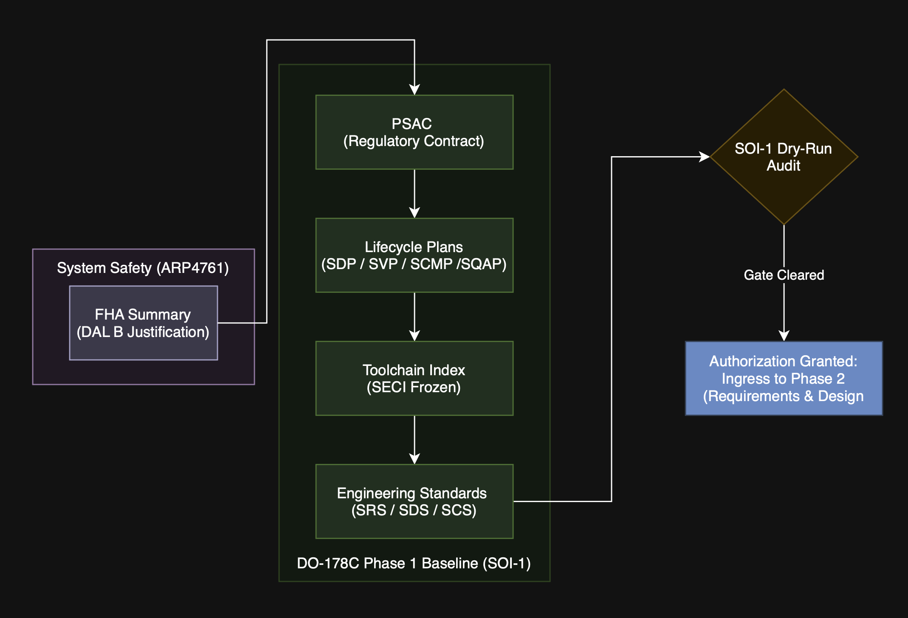
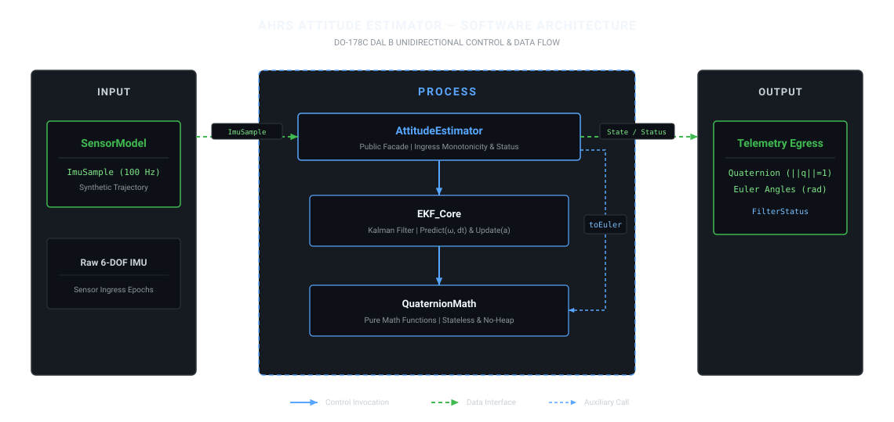

# Attitude Estimator — Full DO-178C Lifecycle Simulation

This repository implements a 6-DOF IMU pitch and roll attitude estimator using an Extended Kalman Filter (EKF), simulating the complete verification and certification lifecycle mandated by **RTCA DO-178C** (Design Assurance Level B/C).

> **Aviation Certification Framework:**  
> This project demonstrates the step-by-step engineering processes required to achieve flight authorization, progressing sequentially through each Stage of Involvement (SOI) audit.

---

## 1. Problem & Performance Targets

Estimating orientation from low-cost MEMS sensors requires combining rate gyroscopes (subject to drift) with accelerometers (subject to vibration and dynamic acceleration).

* **Steady-State Error**: Less than 1.5 degrees in pitch and roll under nominal static conditions.
* **Dynamic Recovery**: Convergence from an orientation error greater than 30 degrees within 3.0 seconds.
* **Numerical Stability**: Zero filter divergence over a continuous 10-minute simulated trajectory.

*(Initial targets derived from typical MEMS noise characteristics; validated empirically against synthetic ground-truth datasets).*

---

## 2. Phase 1 — Planning & Lifecycle Governance (SOI-1)

Before developing requirements or code, RTCA DO-178C / EUROCAE ED-12C mandates establishing, baselining, and approving the lifecycle governance plans, technical standards, and tool qualification assumptions:

* **Stage Target**: Stage of Involvement 1 (SOI-1) Review — Software Planning and Standards Approval.
* **Stage Status**: **SIMULATION PASSED / DRY-RUN GATE CLEARED** (Baseline locked under tag [`v0.1.0-SOI-1`](https://github.com/TomasUPV/attitude-estimator-cpp/releases/tag/v0.1.0-SOI-1)).

### Baseline Lifecycle Artifacts (v1.0 Frozen)

* **System Safety & Criticality Allocation**:
  * [`docs/planning/FHA_summary.md`](docs/planning/FHA_summary.md): Functional Hazard Assessment (ARP4761) allocating **DAL B** to prevent Hazardously Misleading Information (HMI).
* **Regulatory Contract**:
  * [`docs/planning/PSAC.md`](docs/planning/PSAC.md): Plan for Software Aspects of Certification establishing system architecture, compliance matrices, and DO-178C Table A-1 objectives.
* **Core Lifecycle Management Plans**:
  * [`docs/planning/SDP.md`](docs/planning/SDP.md): Software Development Plan (V-model, deterministic C++17 design rules, static footprint).
  * [`docs/planning/SVP.md`](docs/planning/SVP.md): Software Verification Plan (Requirements-Based Testing via GoogleTest, static analysis linters, Decision Coverage target).
  * [`docs/planning/SCMP.md`](docs/planning/SCMP.md): Software Configuration Management Plan (Git branching model, change control, cryptographic release tagging).
  * [`docs/planning/SQAP.md`](docs/planning/SQAP.md): Software Quality Assurance Plan (Independent peer reviews, conformity audits, process integrity).
* **Engineering Standards**:
  * [`docs/standards/SRS.md`](docs/standards/SRS.md): Software Requirements Standard (Syntax guidelines, verifiability criteria, no implementation coupling).
  * [`docs/standards/SDS.md`](docs/standards/SDS.md): Software Design Standard (Modular partitioning, memory invariants, deterministic execution bounds).
  * [`docs/standards/SCS.md`](docs/standards/SCS.md): Software Code Standard (MISRA/CERT-aligned C++17 rules: no `malloc`/`new`, fixed-width types `float64_t`).
* **Environment Control**:
  * [`docs/planning/SECI.md`](docs/planning/SECI.md): Software Environment Configuration Index (Deterministic build/test toolchain versions frozen).

### SOI-1 Dry-Run & Process Verification Audit

A simulated compliance dry run was executed against the **DO-178C Table A-1** lifecycle planning objectives to authorize progression into software development:

* [`docs/planning/SOI_1_checklist.md`](docs/planning/SOI_1_checklist.md): Formal compliance audit gate verifying document baselines, DAL allocation integrity, toolchain reproducibility, and transition criteria. All verification checklist points marked as satisfied (`PASS`).

<em>Figure 1: DO-178C Phase 1 (SOI-1) Lifecycle Baseline & Audit Progression Pipeline.</em>

---

## 3. Phase 2 — Requirements & Architecture (SOI-2)

Following planning approval, DO-178C Section 5.1 and Section 5.2 mandate developing High-Level Requirements (HLR), allocating them to a decoupled software architecture, and deriving Low-Level Requirements (LLR):

* **Stage Target**: Stage of Involvement 2 (SOI-2) Review — Requirements and Software Architecture Baseline.
* **Stage Status**: **SIMULATION PASSED / GATE CLEARED** (Baseline locked under tag [`v0.2.0-SOI-2`](https://github.com/TomasUPV/attitude-estimator-cpp/releases/tag/v0.2.0-SOI-2)).

### Audited Technical Artifacts (v1.1 Frozen)

* **High-Level Requirements (HLR)**:
  * [`docs/requirements/HLR.md`](docs/requirements/HLR.md): 14 verifiable requirements across Functional (`HLR-FNC-*`), Performance (`HLR-PRF-*`), Interface (`HLR-IFC-*`), and Derived Safety (`HLR-SAF-*`) categories conforming strictly to normative `shall` syntax.
* **Software Architecture Description (SAD)**:
  * [`docs/design/architecture.md`](docs/design/architecture.md): Formal architecture detailing modular partitioning under `namespace attitude`, Row-Major stack memory matrix layout ($k = i \cdot N + j$), zero dynamic heap allocation, and the stale-data fault containment counter ($N_{drop} > 10$).
* **Modular Low-Level Design (LLRs)**:
  * [`docs/design/quaternion_math.md`](docs/design/quaternion_math.md): Pure, stateless mathematical primitives (`LLR-QM-001..006`).
  * [`docs/design/sensor_model.md`](docs/design/sensor_model.md): Ingress contracts and 6-DOF synthetic verification generator (`LLR-SM-001..006`).
  * [`docs/design/ekf_core.md`](docs/design/ekf_core.md): Kalman state propagation, gravity innovation, and covariance symmetrization (`LLR-EKF-001..009`).
  * [`docs/design/attitude_estimator.md`](docs/design/attitude_estimator.md): Public facade orchestrating sample validation, delta-time monitoring, and query interfaces (`LLR-AE-001..007`).
* **Requirements Traceability Matrix (RTM)**:
  * [`docs/requirements/traceability_matrix.md`](docs/requirements/traceability_matrix.md): 100% bidirectional traceability between canonical HLRs and LLRs with zero orphaned elements.

### SOI-2 Peer Review & Re-Audit Records

The requirements and architecture baseline underwent an independent verification review and re-audit:
* [`docs/verification/SOI_2_peer_review_report.md`](docs/verification/SOI_2_peer_review_report.md): Initial dry-run identifying 9 findings (`F-HLR-01..05` and `F-ARC-01..04`).
* [`docs/verification/SOI_2_reaudit_report.md`](docs/verification/SOI_2_reaudit_report.md): Formal re-audit verifying 100% closure of all 9 findings, satisfying DO-178C Table A-2 and Table A-3 objectives for DAL B.

---

## 4. Architecture Overview & Data Flow

The software architecture operates under a strictly **unidirectional control hierarchy** and clear data interfaces across four decoupled modules, operating without dynamic heap allocations:

<em>Figure 2: DO-178C Phase 2 Hierarchical Control &amp; Data Flow Architecture (DAL B Compliant).</em>

### Modular Responsibilities
* **`AttitudeEstimator` (Public Facade)**: Coordinates sample ingestion, enforces temporal monotonicity ($0 < \Delta t \le 0.10\text{ s}$), tracks consecutive invalid samples ($N_{drop} > 10 \to \text{STATUS\_STALE\_DATA}$), and exposes orientation queries without leaking internal mutable state.
* **`EKF_Core` (State Estimation Engine)**: Discrete quaternion Kalman filter algorithm. Propagates state and covariance matrices via numerical Jacobian evaluations, applies gravity innovation with accelerometer plausibility gating ($7.848 \le \Vert{}a\Vert{} \le 11.772\text{ m/s}^2$), and enforces covariance symmetry ($P = \frac{1}{2}(P + P^T)$). Matrices adhere to contiguous Row-Major storage ($k = i \cdot N + j$).
* **`QuaternionMath` (Pure Algebraic Kernel)**: Stateless, pure functions ($O(1)$ stack, zero side-effects). Performs Hamilton products, vector rotations, defensive normalizations ($\epsilon = 1.0\times 10^{-12}$), and Tait-Bryan $Z-Y-X$ Euler transformations with deterministic singularity clamping.
* **`SensorModel` (Data Contracts & Harness)**: Defines synchronized IMU ingress data structures (`ImuSample`, `AccelReading`, `GyroReading`) and generates 6-DOF synthetic trajectories with additive Gaussian noise paired with ground-truth for error tracking.

---

## 5. Next Milestone: Phase 3 — Implementation & Verification (SOI-3)

With the requirements and architecture baselines approved, the project transitions into DO-178C Table A-4, A-5, and A-6 objectives:
1. Deterministic C++17 implementation of modules in `src/` conforming strictly to `SCS.md`.
2. Requirements-Based Testing (RBT) with GoogleTest (`tests/`) covering normal, robustness, and boundary conditions.
3. Automated static analysis (`clang-tidy`, `cppcheck`) and Decision/Branch structural coverage analysis.
