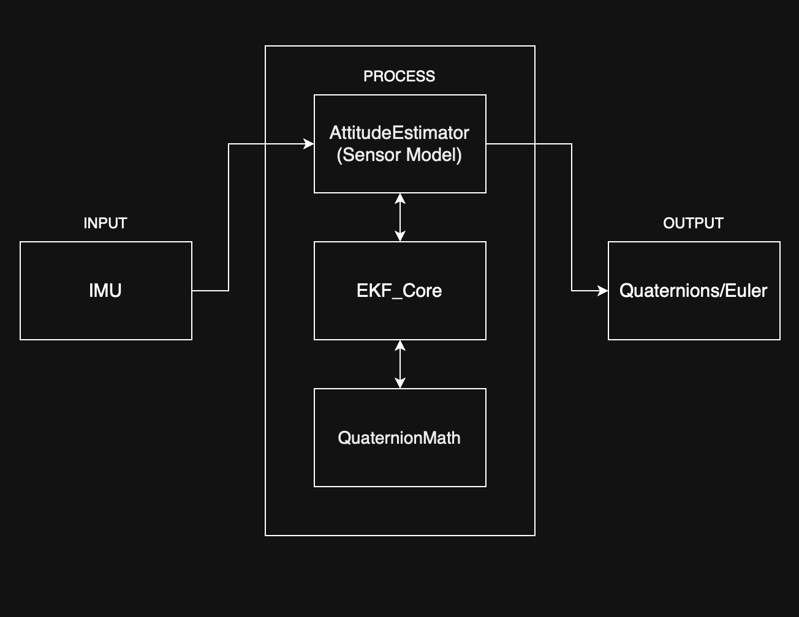

# Software Architecture Description (SAD) — Attitude Estimator

**System Item:** Attitude & Heading Reference System (AHRS) — Attitude Estimator Core  
**Governing Standard:** RTCA DO-178C / EUROCAE ED-12C Section 5.2 & Table A-3  
**Design Standard Reference:** `docs/standards/SDS.md`  
**Target Baseline:** DAL B  
**Document Version:** 1.0 (SOI-2 Baseline)  
**Status:** draft/Working in progress 

---

## 1. Architectural Overview & Modular Decomposition

The Attitude Estimator architecture is designed around four decoupled, single-responsibility modules operating under a strictly unidirectional control and data-flow paradigm.


       

## 2. Core Modules & Responsibilities

| Module | Design File | Responsibility & Coupling Bounds |
| :--- | :--- | :--- |
| **`QuaternionMath`** | `docs/design/quaternion_math.md` | Pure algorithmic functions for quaternion operations, conjugate, inverse, Hamilton product, vector rotation, and normalization. No state or external dependencies. |
| **`SensorModel`** | `docs/design/sensor_model.md` | Ingress data representation and synthetic ground-truth sensor trajectory model for requirements-based verification. |
| **`EKF_Core`** | `docs/design/ekf_core.md` | Algorithmic filter mechanics: time-update step (covariance integration), measurement-update step (innovation, Kalman gain), and covariance symmetry enforcement. |
| **`AttitudeEstimator`** | `docs/design/attitude_estimator.md` | Public API facade. Orchestrates timestamp checks, guardrails against degenerate inputs, encapsulates filter state, and enforces unit normalization. |

---

## 3. Data Representation & Static Type Definitions

In strict conformance with `docs/standards/SCS.md`, the architecture specifies static, fixed-width types and forbids runtime heap allocation:

```cpp
namespace ahrs {

using Real = double;

struct Vector3 {
    Real x{0.0};
    Real y{0.0};
    Real z{0.0};
};

struct Quaternion {
    Real w{1.0};
    Real x{0.0};
    Real y{0.0};
    Real z{0.0};
};

struct EulerAngles {
    Real roll{0.0};   
    Real pitch{0.0};  
    Real yaw{0.0};    
};

struct ImuMeasurement {
    Vector3 accel;    
    Vector3 gyro;   
    Real dt;        
};

using Matrix4x4 = std::array<Real, 16>;
using Matrix3x3 = std::array<Real, 9>;

}
```
## 4. Deterministic Invariants & Safety Mitigations

In accordance with DO-178C Table A-3 Objectives and `FHA_summary.md`:

1. **Deterministic Execution & Memory Limits:**
   * Dynamic heap allocation (`new`, `malloc`) is completely excluded.
   * Recursion (direct or indirect) is forbidden.
   * Maximum function stack consumption is bounded at design time.

2. **Computational Guardrails & Division by Zero:**
   * Every division operation (e.g., vector or quaternion normalization) is protected by an explicit epsilon threshold ($\epsilon = 1.0\times 10^{-12}$). If norm $\le \epsilon$, a safe default unit orientation is enforced.

3. **Temporal Monotonicity & Step Guardrails:**
   * The facade strictly checks $0.0 < \Delta t \le 0.10\text{ s}$. Any non-compliant sample is discarded, maintaining the last verified attitude state.

4. **Covariance Matrix Symmetry & Positive Semidefiniteness:**
   * Numerical truncation in floating-point operations can induce asymmetry in the error covariance matrix $P$. The filter architecture enforces $P = \frac{1}{2}(P + P^T)$ after every update step.

---

## 5. Architectural Review Checklist (DO-178C Table A-3 Verification)

| Item # | Verification Criteria | DO-178C Reference | Verification Method | Result (Pass / Fail / In Work) | Review Findings / Evidence |
| :--- | :--- | :--- | :--- | :--- | :--- |
| **CHK-ARC-01** | Are software architecture requirements compatible with High-Level Requirements? | Table A-3 (Obj 1) | Analysis / Trace | [ ] | |
| **CHK-ARC-02** | Is the software architecture consistent with the Software Design Standard (`SDS.md`)? | Table A-3 (Obj 2) | Visual Inspection | [ ] | |
| **CHK-ARC-03** | Is the architecture deterministic (no recursion, zero runtime heap allocation)? | Table A-3 (Obj 3) | Visual Inspection | [ ] | |
| **CHK-ARC-04** | Are interfaces and data flow between modules explicitly defined and bounded? | Table A-3 (Obj 4) | Interface Review | [ ] | |
| **CHK-ARC-05** | Are partition boundaries and safety-derived invariants enforced against faults? | Table A-3 (Obj 5) | Boundary Review | [ ] | |

### Review & Sign-off Record
* **Target Baseline:** `docs/design/architecture.md` (v1.0 Baseline)
* **Author / Submitter:** Software Development Team | Date: 2026-09-28
* **Independent Reviewer (Verification Role):** ____________________ | Date: ____________
* **SQA Gatekeeper Approval:** ____________________ | Date: ____________
