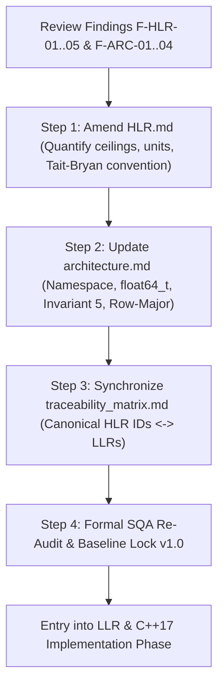

# RTCA DO-178C / EUROCAE ED-12C Stage of Involvement 2 (SOI-2)
## Independent Peer Review & Software Quality Assurance (SQA) Audit Report

> [!NOTE]
> **ACADEMIC SIMULATION & HANDS-ON LEARNING STUDY DISCLAIMER**  
> This independent verification review is conducted as an **academic simulation and process training exercise** designed to replicate the engineering discipline, objective rigor, and gatekeeping protocols of **RTCA DO-178C / EUROCAE ED-12C (DAL B objectives)**. This is not a commercial aerospace artifact seeking formal FAA/EASA type certification. All verification verdicts, sign-offs, and quality records represent a simulated Stage of Involvement 2 (SOI-2) baseline audit.

---

### Audit Identification & Scope Summary

| Field | Record Detail |
| :--- | :--- |
| **System Item** | Attitude & Heading Reference System (AHRS) — Attitude Estimator Function |
| **Lifecycle Phase / Review Gate** | Stage of Involvement 2 (SOI-2) — Requirements & Architecture Baseline Dry-Run |
| **Design Assurance Level (Target)** | **DAL B** (with DAL C Standby Architecture Applicability per `docs/planning/FHA_summary.md`) |
| **Audit Role** | Independent Airborne Software Verification Engineer & SQA Gatekeeper (Simulation) |
| **Audit Date** | 2026-09-28 |
| **Target Artifact 1 Under Review** | `docs/requirements/HLR.md` (v1.0 Baseline Draft) |
| **Target Artifact 2 Under Review** | `docs/design/architecture.md` (v1.0 Baseline Draft) |
| **Governing Standards** | `docs/standards/SRS.md` (Requirements), `docs/standards/SDS.md` (Design), `docs/standards/SCS.md` (Code), `docs/planning/FHA_summary.md` (Safety) |
| **Overall Gate Verdict** | **CONDITIONALLY APPROVED — ACTION ITEMS REQUIRED PRIOR TO BASELINE LOCK** |

---

## 1. Executive Summary & Audit Assessment

An independent verification audit of the **High-Level Requirements (HLR)** and **Software Architecture Description (SAD)** baselines was performed in accordance with DO-178C Section 5.1, Section 5.2, Table A-2, and Table A-3.

### 1.1 Technical Merits & Strengths
* **Strict Normative Modality:** All high-level requirements across functional, performance, interface, and safety sections strictly maintain `shall` grammar without any use of ambiguous verbs (`should`, `may`, `will`).
* **Deterministic Real-Time Architecture:** Zero runtime dynamic heap allocation (`new`, `delete`, `malloc`, `free`), exclusion of recursion, compile-time static array allocation (`std::array`), and bounded stack depth are enforced.
* **Robust Algorithmic Invariants:** Defensive arithmetic is incorporated into the architecture, including explicit division-by-zero protection ($\epsilon = 1.0\times 10^{-12}$) with safe quaternion fallback, covariance symmetrization ($P = \frac{1}{2}(P + P^T)$), and sample timestamp monotonicity enforcement ($0 < \Delta t \le 0.10\text{ s}$).
* **Explicit Derived Safety Traceability:** All safety requirements (`HLR-SAF-001` through `HLR-SAF-004`) are properly identified as Derived Requirements and traced directly to the system safety allocations in `docs/planning/FHA_summary.md` Section 5 (`SR-SAF-001`, `SR-SAF-002`, `SR-SAF-003`) to mitigate Hazardously Misleading Information (`FHA-AHRS-001`).

### 1.2 Core Discrepancies & Deficiencies (Summary)
* **Break in Bidirectional Traceability (Major):** `docs/requirements/traceability_matrix.md` and all design documents in `docs/design/` currently map to legacy deprecated identifiers (`HLR-001` through `HLR-009`) instead of the newly standardized category-based identifiers (`HLR-FNC-*`, `HLR-PRF-*`, `HLR-IFC-*`, `HLR-SAF-*`).
* **Architectural Safety Invariant Omission (Major):** `HLR-SAF-003` ($\pm 20\%$ gravity acceleration deviation threshold) is missing from the Invariants section of `docs/design/architecture.md`.
* **Missing Matrix Memory Layout & Inter-Module API Contracts (Minor):** `docs/design/architecture.md` defines flat arrays for matrices without specifying Row-Major vs. Column-Major storage layout, and omits concrete method signatures for inter-module data flow.
* **Standard Discrepancy & Type Aliasing (Minor):** `docs/design/architecture.md` defines `namespace ahrs` and `using Real = double;`, which directly violates `docs/standards/SCS.md` Section 2.1 and `docs/standards/SDS.md` Section 3.2 (which mandate explicit type `attitude::float64_t` under `namespace attitude`).

---

## 2. Evaluation of Artifact 1: `docs/requirements/HLR.md`
**Target Process:** RTCA DO-178C Table A-2 Objectives (Software Requirements Process)  
**Governing Standard:** `docs/standards/SRS.md`

### 2.1 Item-by-Item Verification Analysis

1. **`CHK-SRS-01` (Mandatory Modality — DO-178C §5.1.2.a):**
   * *Analysis:* Examined all 14 requirements across Sections 1 to 4 (`HLR-FNC-001..004`, `HLR-PRF-001..004`, `HLR-IFC-001..002`, `HLR-SAF-001..004`). Every requirement statement uses the prescriptive modal auxiliary verb `shall`. Ambiguous auxiliaries (`should`, `may`, `will`) are completely absent.
   * *Status:* **Pass**

2. **`CHK-SRS-02` (Absence of Ambiguity — DO-178C §5.1.2.b):**
   * *Analysis:* Statements avoid colloquialisms and subjective modifiers. However, `HLR-PRF-003` states: *"The system shall maintain bounded orientation error without divergence across a continuous 10.0-minute... flight profile"*. The phrasing *"bounded orientation error without divergence"* lacks a defined upper numerical bound $\epsilon_{max}$. In addition, `HLR-FNC-004` does not specify the Euler rotation sequence (e.g., Tait-Bryan $Z-Y-X$ / 3-2-1 convention).
   * *Status:* **Fail** *(Refer to Findings F-HLR-01 & F-HLR-02)*

3. **`CHK-SRS-03` (Verifiability & Quantifiable Tolerances — DO-178C §6.2.2.a):**
   * *Analysis:* Numerical thresholds with SI units are established across requirements (e.g., $1.5^\circ$ RMS, $3.0\text{ s}$ convergence, $\Delta t = 0.01\text{ s}$, $|\Vert q\Vert - 1.0| \le 1.0\times 10^{-6}$, $\pm 20\%$ gravity window). However, `HLR-PRF-001` omits the observation window duration over which the steady-state RMS error is computed, and `HLR-PRF-003` lacks a concrete dynamic error ceiling.
   * *Status:* **Fail** *(Refer to Finding F-HLR-02)*

4. **`CHK-SRS-04` (Input/Output Domain Completeness — DO-178C §5.1.2.b):**
   * *Analysis:* Boundary conditions are defined for time intervals ($\Delta t \le 0$ and $\Delta t > 0.10\text{ s}$) and gravity acceleration norm ($7.848$ to $11.772\text{ m/s}^2$). However, `HLR-IFC-001` does not specify physical saturation limits for sensor inputs (e.g., $|\omega| \le 35\text{ rad/s}$, $\|a\| \le 160\text{ m/s}^2$). Furthermore, fallback output states upon sample rejection in `HLR-SAF-001` and gimbal lock singularity behavior in `HLR-FNC-004` ($\theta = \pm 90^\circ$) are omitted.
   * *Status:* **Fail** *(Refer to Findings F-HLR-03 & F-HLR-04)*

5. **`CHK-SRS-05` (Implementation Independence — DO-178C §5.1.2.a):**
   * *Analysis:* Requirements describe functional objectives rather than code structures. `HLR-SAF-004` cites C++ library primitives (`malloc`, `free`, `new`, `delete`); while this borders on implementation detail, in DO-178C avionics practice it represents an acceptable safety-derived memory allocation constraint.
   * *Status:* **Pass**

6. **`CHK-SRS-06` (Traceability Integrity — DO-178C §5.5 & Table A-2 Obj 6):**
   * *Analysis:* Every HLR statement has an immutable ID. However, an audit of `docs/requirements/traceability_matrix.md` and design specifications in `docs/design/` shows they still map to legacy IDs `HLR-001` through `HLR-009`. None of the new category identifiers (`HLR-FNC-*`, `HLR-PRF-*`, `HLR-IFC-*`, `HLR-SAF-*`) are recorded in the matrix.
   * *Status:* **Fail** *(Refer to Finding F-HLR-05)*

7. **`CHK-SRS-07` (Derived Safety Identification — DO-178C §5.2.2 & Table A-2 Obj 1):**
   * *Analysis:* All four requirements in Section 4 are explicitly declared as Derived Requirements and traced back to safety objectives in `docs/planning/FHA_summary.md` Section 5 (`SR-SAF-001`, `SR-SAF-002`, `SR-SAF-003`, and `FHA-AHRS-001`).
   * *Status:* **Pass**

---

### 2.2 Populated Requirements Review Checklist (DO-178C Table A-2)

| Item # | Verification Check Item | DO-178C Criteria Reference | Verification Method | Result (Pass / Fail / In Work) | Review Findings / Evidence |
| :--- | :--- | :--- | :--- | :--- | :--- |
| **CHK-SRS-01** | **Mandatory Modality:** Does every requirement state normative intent using `shall` syntax, excluding ambiguous verbs (`should`, `may`, `will`)? | Section 5.1.2.a | Visual Inspection | **[X] Pass** | 100% compliance across all 14 HLRs; no non-normative auxiliary verbs detected. |
| **CHK-SRS-02** | **Absence of Ambiguity:** Is the statement free of qualitative/untestable terms (e.g., *fast*, *robust*, *optimized*, *TBD*)? | Section 5.1.2.b | Lexical Search / Peer Review | **[ ] Fail** | Finding F-HLR-01: `HLR-PRF-003` uses unquantified phrase "without divergence". Finding F-HLR-02: `HLR-FNC-004` omits Euler sequence convention. |
| **CHK-SRS-03** | **Verifiability & Quantifiable Tolerances:** Does the requirement establish numerical thresholds, timing bounds, SI units, and deterministic limits? | Section 6.2.2.a | Review vs Scope Targets | **[ ] Fail** | Finding F-HLR-01: Dynamic error ceiling missing in `HLR-PRF-003`. Finding F-HLR-02: Steady-state evaluation window missing in `HLR-PRF-001`. |
| **CHK-SRS-04** | **Input/Output Domain Completeness:** Are nominal operating intervals, boundary/edge conditions, and invalid inputs explicitly addressed? | Section 5.1.2.b | Boundary Analysis Review | **[ ] Fail** | Finding F-HLR-03: `HLR-IFC-001` lacks sensor saturation/NaN boundaries. Finding F-HLR-04: Fallback output state in `HLR-SAF-001` unstated. |
| **CHK-SRS-05** | **Implementation Independence:** Does the HLR define functional intent without dictating programming language constructs or local variables? | Section 5.1.2.a | Architecture Decoupling Check | **[X] Pass** | Functional intent clearly separated from language implementation; memory allocation constraints in `HLR-SAF-004` reflect valid safety allocations. |
| **CHK-SRS-06** | **Traceability Integrity:** Is the requirement assigned an immutable identifier and registered bidirectionally in the RTM? | Section 5.5 / Table A-2 | Traceability Audit | **[ ] Fail** | Finding F-HLR-05: Critical desynchronization. `traceability_matrix.md` and LLR design documents still reference obsolete `HLR-001`..`HLR-009`. |
| **CHK-SRS-07** | **Derived Safety Identification:** If the requirement is derived (e.g., `HLR-SAF-*`), has it been formally flagged and reported to system safety? | Section 5.2.2 / FHA | Safety Assessment Check | **[X] Pass** | All derived safety requirements (`HLR-SAF-001..004`) are formally flagged and traced to `FHA_summary.md` (`SR-SAF-001..003`). |

### 2.3 Sign-off Record — High-Level Requirements

```text
================================================================================
RTCA DO-178C / EUROCAE ED-12C VERIFICATION REVIEW SIGN-OFF RECORD
================================================================================
Target Baseline:       docs/requirements/HLR.md (Version 1.0 Baseline Draft)
Verification Scope:    DO-178C Section 5.1 / Table A-2 Objectives (DAL B)
Author / Submitter:    Software Engineering Team           | Date: 2026-09-28
Independent Reviewer:  Independent Verification Agent (Sim)| Date: 2026-09-28
SQA Gatekeeper:        SQA Gatekeeper Audit Role (Sim)     | Date: 2026-09-28
Review Verdict:        CONDITIONALLY APPROVED (Pending Action Items F-HLR-01..05)
================================================================================
```

---

## 3. Evaluation of Artifact 2: `docs/design/architecture.md`
**Target Process:** RTCA DO-178C Table A-3 Objectives (Software Design Process)  
**Governing Standard:** `docs/standards/SDS.md` & `docs/standards/SCS.md`

### 3.1 Item-by-Item Verification Analysis

1. **`CHK-ARC-01` (Compatibility with High-Level Requirements — Table A-3 Obj 1):**
   * *Analysis:* The modular partitioning (`QuaternionMath`, `SensorModel`, `EKF_Core`, `AttitudeEstimator`) directly fulfills functional propagation and measurement correction. However, `HLR-SAF-003` ($\pm 20\%$ gravity acceleration deviation threshold) is missing from the Invariants section of `docs/design/architecture.md`. It is not allocated to `EKF_Core` or `AttitudeEstimator`.
   * *Status:* **Fail** *(Refer to Finding F-ARC-01)*

2. **`CHK-ARC-02` (Consistency with Software Design & Code Standards — Table A-3 Obj 2):**
   * *Analysis:* `docs/design/architecture.md` declares `namespace ahrs` and `using Real = double;`. This violates `docs/standards/SCS.md` Section 2.1 (which strictly prohibits raw primitive types like `double`) and `docs/standards/SDS.md` Section 3.2 (which mandates `attitude::float64_t`). Furthermore, the official project namespace established in the header files (`include/attitude_estimator/types.h`, `include/attitude_estimator/quaternion_math.h`) is `namespace attitude`, not `namespace ahrs`. In addition, `docs/design/architecture.md` defines `struct ImuMeasurement`, which differs in structure and naming from `SensorModel`'s `ImuSample`, `AccelReading`, and `GyroReading`.
   * *Status:* **Fail** *(Refer to Finding F-ARC-02)*

3. **`CHK-ARC-03` (Deterministic Execution & Memory Footprint — Table A-3 Obj 3):**
   * *Analysis:* Runtime heap allocation (`malloc`, `free`, `new`, `delete`) is explicitly prohibited. Memory is bounded using compile-time static containers (`std::array<Real, 16>`). Direct and indirect recursion is forbidden, ensuring static WCET schedulability and stack bound predictability.
   * *Status:* **Pass**

4. **`CHK-ARC-04` (Interfaces & Data Flow Definition — Table A-3 Obj 4):**
   * *Analysis:* The unidirectional architectural dependency structure is well defined. However:
     * Matrix layout: `Matrix4x4` and `Matrix3x3` are defined as flat `std::array` instances without specifying memory storage order (Row-Major vs. Column-Major). In EKF matrix transformations ($F P F^T$ and $H P H^T$), differing layout assumptions between modules cause catastrophic matrix transposition errors.
     * Inter-module method signatures, parameter passing semantics (pass-by-value vs. `const&`), and error code return structures are omitted from `docs/design/architecture.md`.
   * *Status:* **Fail** *(Refer to Finding F-ARC-03)*

5. **`CHK-ARC-05` (Partition Boundaries & Safety Invariants — Table A-3 Obj 5):**
   * *Analysis:* Guardrails are defined for division by zero ($\epsilon = 1.0\times 10^{-12}$), timestamp monotonicity ($0 < \Delta t \le 0.10\text{ s}$), and covariance symmetry ($P = \frac{1}{2}(P + P^T)$). However, the fault containment strategy is incomplete: when non-compliant samples are discarded, `docs/design/architecture.md` states that the last verified attitude state is maintained, but defines no persistent rejection threshold (stale-data timeout). If the sensor fails permanently, the filter silently outputs frozen attitude data indefinitely, directly precipitating Hazard **`FHA-AHRS-001` (Hazardously Misleading Information)**.
   * *Status:* **Fail** *(Refer to Finding F-ARC-04)*

---

### 3.2 Populated Architectural Review Checklist (DO-178C Table A-3)

| Item # | Verification Criteria | DO-178C Reference | Verification Method | Result (Pass / Fail / In Work) | Review Findings / Evidence |
| :--- | :--- | :--- | :--- | :--- | :--- |
| **CHK-ARC-01** | Are software architecture requirements compatible with High-Level Requirements? | Table A-3 (Obj 1) | Analysis / Trace | **[ ] Fail** | Finding F-ARC-01: Invariant for `HLR-SAF-003` ($\pm 20\%$ gravity window) omitted from SAD invariants and module allocations. |
| **CHK-ARC-02** | Is the software architecture consistent with the Software Design Standard (`SDS.md`)? | Table A-3 (Obj 2) | Visual Inspection | **[ ] Fail** | Finding F-ARC-02: Uses `namespace ahrs` and `Real = double`, violating `SDS.md` §3.2 and `SCS.md` §2.1 (`attitude::float64_t`). Struct mismatch with `sensor_model.md`. |
| **CHK-ARC-03** | Is the architecture deterministic (no recursion, zero runtime heap allocation)? | Table A-3 (Obj 3) | Visual Inspection | **[X] Pass** | Zero dynamic heap, no recursion, compile-time static containers (`std::array`), bounded stack depth verified. |
| **CHK-ARC-04** | Are interfaces and data flow between modules explicitly defined and bounded? | Table A-3 (Obj 4) | Interface Review | **[ ] Fail** | Finding F-ARC-03: Matrix memory layout (Row-Major vs Column-Major) undefined for `Matrix4x4`/`Matrix3x3`. Inter-module method signatures omitted. |
| **CHK-ARC-05** | Are partition boundaries and safety-derived invariants enforced against faults? | Table A-3 (Obj 5) | Boundary Review | **[ ] Fail** | Finding F-ARC-04: Lack of stale-data counter / timeout mechanism when discarding invalid samples; risks indefinite frozen attitude output (HMI). |

### 3.3 Sign-off Record — Software Architecture Description

```text
================================================================================
RTCA DO-178C / EUROCAE ED-12C VERIFICATION REVIEW SIGN-OFF RECORD
================================================================================
Target Baseline:       docs/design/architecture.md (Version 1.0 Baseline Draft)
Verification Scope:    DO-178C Section 5.2 / Table A-3 Objectives (DAL B)
Author / Submitter:    Software Development Team           | Date: 2026-09-28
Independent Reviewer:  Independent Verification Agent (Sim)| Date: 2026-09-28
SQA Gatekeeper:        SQA Gatekeeper Audit Role (Sim)     | Date: 2026-09-28
Review Verdict:        CONDITIONALLY APPROVED (Pending Action Items F-ARC-01..04)
================================================================================
```

---

## 4. Formal Review Findings & Action Items (RF / AI Log)

### Summary Findings Table

| Finding ID | Artifact | Severity | DO-178C Objective | Summary Title |
| :--- | :--- | :--- | :--- | :--- |
| **F-HLR-01** | `HLR.md` | Minor | Table A-2 (Obj 2 & 4) | Unquantified Dynamic Error Ceilings in `HLR-PRF-003` |
| **F-HLR-02** | `HLR.md` | Minor | Table A-2 (Obj 2 & 7) | Euler Rotation Sequence & Singularity Unspecified in `HLR-FNC-004` |
| **F-HLR-03** | `HLR.md` | Minor | Table A-2 (Obj 4) | Sensor Physical Ingress Range & Sanitization in `HLR-IFC-001` |
| **F-HLR-04** | `HLR.md` | Minor | Table A-2 (Obj 2) | Fallback State & Flag Semantics Unspecified in `HLR-SAF-001` |
| **F-HLR-05** | `HLR.md` / `RTM` | **Major** | Table A-2 (Obj 6) | Full Desynchronization of Requirements Traceability Matrix |
| **F-ARC-01** | `architecture.md` | **Major** | Table A-3 (Obj 1) | Omission of Accelerometer Rejection Window Invariant in SAD |
| **F-ARC-02** | `architecture.md` | Minor | Table A-3 (Obj 2 & 5) | Type Alias & Namespace Non-Conformance with `SDS.md` / `SCS.md` |
| **F-ARC-03** | `architecture.md` | Minor | Table A-3 (Obj 2 & 4) | Matrix Storage Ordering (Row-Major vs Column-Major) Omission |
| **F-ARC-04** | `architecture.md` | **Major** | Table A-3 (Obj 5) | Missing Stale Data Fault Containment (Persistent Sample Rejection) |

---

### Detailed Technical Discrepancies & Corrective Action Directives

#### Finding F-HLR-01 — Unquantified Dynamic Error Ceilings in `HLR-PRF-003`
* **Deficiency:** `HLR-PRF-003` states that orientation error shall remain *"bounded without divergence across a continuous 10.0-minute... dynamic flight profile"*. The word *"divergence"* is qualitative, and no maximum dynamic error tolerance is established.
* **Safety & Verification Impact:** Requirements-based testing cannot objectively pass or fail dynamic test profiles without an explicit tolerance bound.
* **Corrective Action:** Amend `HLR-PRF-003` to state:  
  *"The system shall maintain a pitch and roll orientation error of less than $3.0^\circ$ ($0.05236\text{ rad}$) RMS and a maximum instantaneous peak error of less than $5.0^\circ$ ($0.08726\text{ rad}$) across a continuous $10.0\text{-minute}$ ($600.0\text{ s}$) simulated dynamic flight profile."*

#### Finding F-HLR-02 — Euler Rotation Sequence & Singularity Unspecified in `HLR-FNC-004`
* **Deficiency:** `HLR-FNC-004` specifies conversion of the quaternion to Euler angles (pitch, roll, yaw), but fails to define the rotation order (e.g., aerospace standard Tait-Bryan intrinsic $Z-Y-X$ sequence) and does not define the mathematical singularity behavior at pitch $\theta = \pm 90^\circ$.
* **Corrective Action:** Explicitly state the Tait-Bryan $Z-Y-X$ convention ($\psi \to \theta \to \phi$) and specify pitch clamping within $[-\pi/2, +\pi/2]$ with deterministic handling when $\cos(\theta) < 1.0\times 10^{-6}$.

#### Finding F-HLR-03 — Sensor Physical Ingress Range & Sanitization in `HLR-IFC-001`
* **Deficiency:** `HLR-IFC-001` specifies input rates and forces without defining the valid physical domain bounds or defensive rejection of non-finite floating-point numbers (`NaN`, `Inf`).
* **Corrective Action:** Specify valid dynamic ranges (e.g., $|\omega| \le 35.0\text{ rad/s}$, $\|a\| \le 160.0\text{ m/s}^2$) and mandate defensive sanitization discarding any sample containing `NaN` or `Inf`.

#### Finding F-HLR-04 — Fallback State & Flag Semantics Unspecified in `HLR-SAF-001`
* **Deficiency:** `HLR-SAF-001` requires rejecting and flagging invalid timesteps, but does not define the resulting filter state or query flag behavior.
* **Corrective Action:** Specify that upon sample rejection, the internal filter state and covariance remain unchanged, and the public query interface reports an explicit invalidity/stale flag.

#### Finding F-HLR-05 (Major) — Full Desynchronization of Requirements Traceability Matrix
* **Deficiency:** `docs/requirements/traceability_matrix.md` and module design files (`attitude_estimator.md`, `ekf_core.md`, `quaternion_math.md`, `sensor_model.md`) still trace to deprecated identifiers `HLR-001`..`HLR-009`. The 14 approved HLRs in `HLR.md` have zero traceability to LLRs or test cases.
* **Safety & Verification Impact:** Complete failure of DO-178C Table A-2 Objective 6 and Table A-4 Objective 1. DAL B compliance cannot be demonstrated without 100% bidirectional traceability.
* **Corrective Action:** Rebuild `traceability_matrix.md` using canonical identifiers (`HLR-FNC-001..004`, `HLR-PRF-001..004`, `HLR-IFC-001..002`, `HLR-SAF-001..004`) and update all downstream design files.

#### Finding F-ARC-01 (Major) — Omission of Accelerometer Rejection Window Invariant in SAD
* **Deficiency:** `HLR-SAF-003` ($\pm 20\%$ gravity acceleration deviation threshold) is missing from the Invariants section of `docs/design/architecture.md`. It is not allocated to `EKF_Core` or `AttitudeEstimator`.
* **Corrective Action:** Add Invariant 5 to `docs/design/architecture.md` Section 4:  
  *"5. Dynamic Acceleration Rejection Window: The filter verifies $7.848\text{ m/s}^2 \le \|a\| \le 11.772\text{ m/s}^2$. Measurements outside this envelope skip the correction step, maintaining pure gyroscopic propagation."*

#### Finding F-ARC-02 — Type Alias & Namespace Non-Conformance with `SDS.md` / `SCS.md`
* **Deficiency:** `docs/design/architecture.md` defines `namespace ahrs` and `using Real = double;`. `docs/standards/SCS.md` Section 2.1 and `docs/standards/SDS.md` Section 3.2 mandate `attitude::float64_t` under `namespace attitude`. Furthermore, `ImuMeasurement` conflicts with `SensorModel`'s `ImuSample`.
* **Corrective Action:** Refactor Section 3 of `docs/design/architecture.md` to use `namespace attitude`, `using Real = attitude::float64_t;`, and harmonize data structure definitions with `docs/design/sensor_model.md`.

#### Finding F-ARC-03 — Matrix Storage Ordering (Row-Major vs Column-Major) Omission
* **Deficiency:** `Matrix4x4 = std::array<Real, 16>` lacks a defined storage order convention.
* **Corrective Action:** Formally specify in `docs/design/architecture.md` that all matrices adhere to **Row-Major layout**, where element $(i, j)$ of an $M \times N$ matrix maps to flat array index $k = i \cdot N + j$.

#### Finding F-ARC-04 (Major) — Missing Stale Data Fault Containment (Persistent Sample Rejection)
* **Deficiency:** If sensor inputs permanently stall or continuously deliver invalid $\Delta t$, `docs/design/architecture.md` states the filter retains its last state indefinitely without raising a timeout or stale-data fault flag. This silent failure mode violates `docs/planning/FHA_summary.md` mitigation for Hazard **`FHA-AHRS-001` (Hazardously Misleading Information)**.
* **Corrective Action:** Specify a consecutive invalid sample counter $N_{drop}$ in `AttitudeEstimator`. If $N_{drop} > 10$ ($> 100\text{ ms}$ at $100\text{ Hz}$), the estimator shall assert a `STATUS_STALE_DATA` / `STATUS_FAULT` flag in the egress query interface.

---

## 5. Transition Criteria & Gate Approval Roadmap

Transition from Stage of Involvement 2 (SOI-2) to Low-Level Requirements (LLR) baselining and Source Code Implementation is **CONDITIONALLY AUTHORIZED**, subject to the completion of the following four-step remediation workflow:



1. **Step 1 — HLR Baseline Refinement:**
   * Update `docs/requirements/HLR.md` with numerical bounds for `HLR-PRF-003`, observation window for `HLR-PRF-001`, Tait-Bryan convention for `HLR-FNC-004`, and input saturation limits for `HLR-IFC-001`.
2. **Step 2 — Architecture Baseline Alignment:**
   * Update `docs/design/architecture.md` to use `namespace attitude`, `attitude::float64_t`, Row-Major matrix indexing rules, Invariant 5 (gravity window), and persistent sample rejection fault counters.
3. **Step 3 — Traceability Matrix Synchronisation:**
   * Update `docs/requirements/traceability_matrix.md` and modular design files (`attitude_estimator.md`, `ekf_core.md`, `quaternion_math.md`, `sensor_model.md`) to reflect canonical `HLR-xxx-nnn` identifiers.
4. **Step 4 — Final Baseline Sign-off:**
   * SQA Gatekeeper re-verifies closure of Findings `F-HLR-05`, `F-ARC-01`, and `F-ARC-04` to officially lock the SOI-2 technical baseline.
